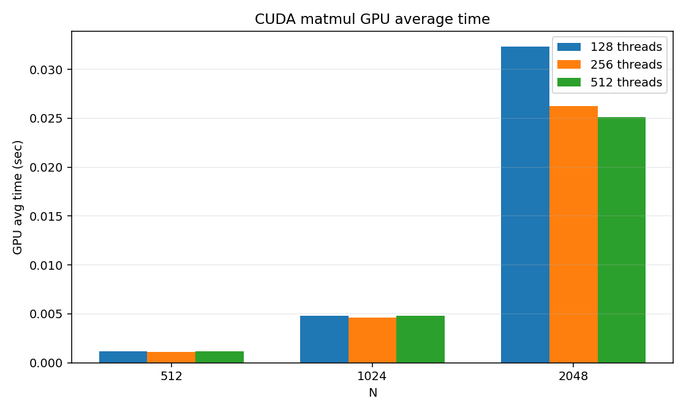
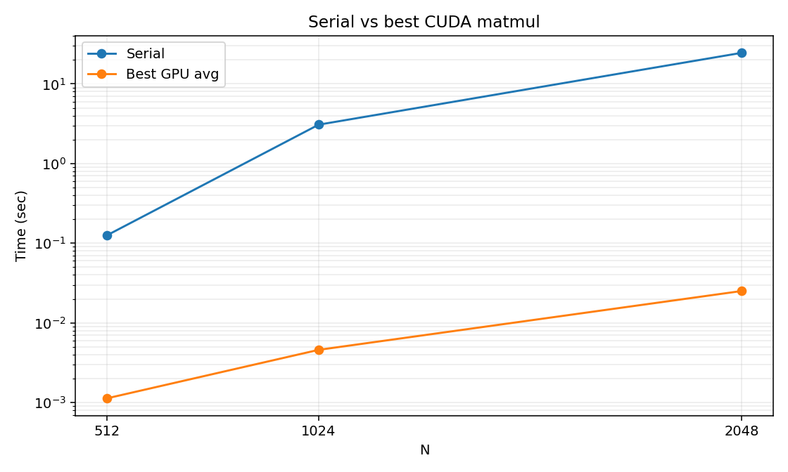
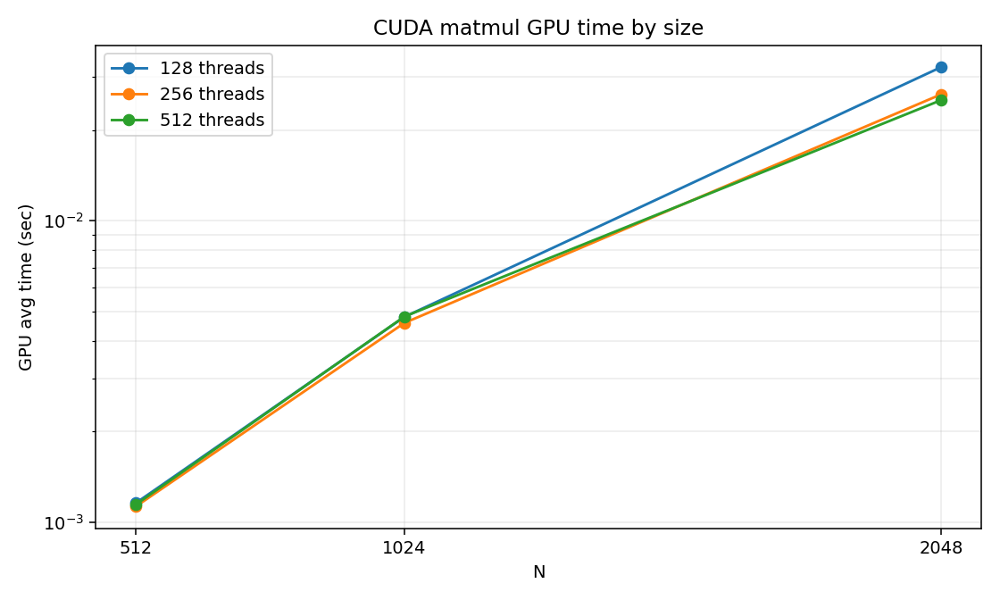
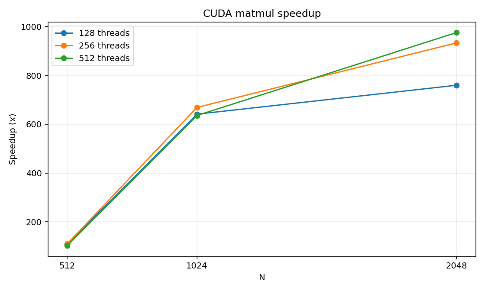
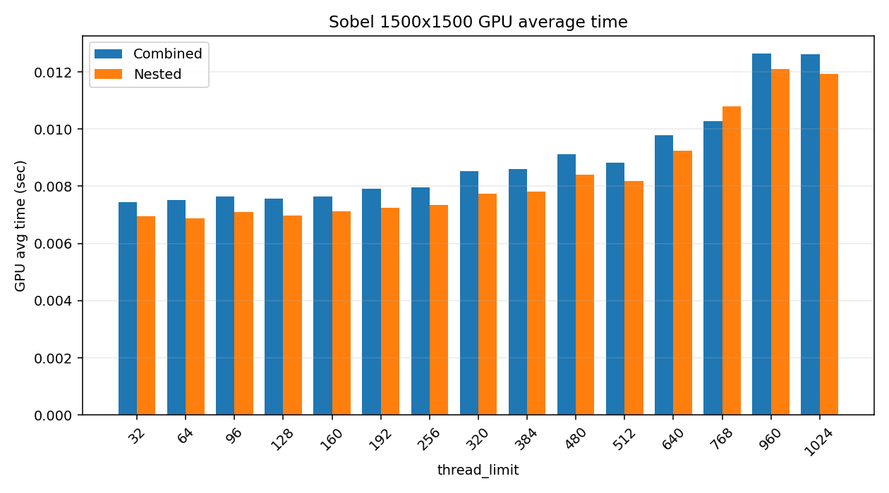
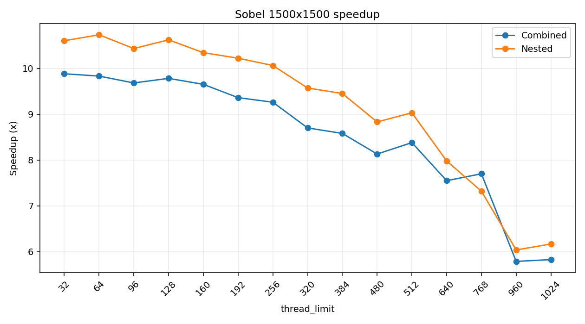

# MYE023 – Parallel Systems, Assignment #2 (GPU)

Two problems parallelized on the GPU:

1. Matrix multiplication with CUDA
2. Sobel filter with OpenMP target offloading

Both exercises are compared with the serial version and I measure the speedup.

Student: Athanasios Fourkiotis (ID 4940) — 2025–26
Ran on: parallax (NVIDIA Tesla P40)

## What the assignment asks

Take two classic problems and move them to the GPU: (1) matrix multiplication `C = A · B` written directly in CUDA, for different matrix sizes and different threads-per-block, and (2) a Sobel edge-detection filter offloaded with OpenMP `target` directives, playing with `num_teams` and `thread_limit`. In both cases you have to verify the GPU result against the serial one and measure the speedup.

## How I solved it

**Matmul (CUDA).** I first wrote the naive kernel where every thread reads straight from global memory, but it was much slower, so I switched to a **tiled** version with shared memory: each block loads a 16-wide tile of A and B into shared memory, all the threads of the block use it, and the loop walks the k dimension tile by tile with `__syncthreads()` between loads. The blocks are 2D (16 × THREADS/16), so the same kernel works for 128, 256 and 512 threads per block. The timing includes the host↔device transfers (that's the honest number if you actually want the result back), there's a warm-up run so the first-launch initialization cost doesn't pollute the measurement, and the result gets double-checked: against the serial multiplication and against the provided `Cmat<N>.txt`.

**Sobel (OpenMP target).** The filter runs a 3×3 convolution per pixel on each RGB channel, with clamping at the image borders. I made two GPU versions to compare: a **combined** one where a single `target teams distribute parallel for collapse(2)` directive spreads all the pixels, and a **nested** one where `teams distribute` splits the rows and an inner `parallel for` splits the columns. The input channels ship to the GPU with `map(to:)` and the outputs come back with `map(from:)`. The per-pixel sums are local variables, so there are no race conditions. I swept `(thread_limit, num_teams)` combinations sized to cover the P40's 3840 cores (thread limits in multiples of 32, since that's the warp size), and the output is checked pixel by pixel against the serial version.

The interesting outcome is in the report: the GPU wins big on the matmul (lots of compute per byte), while on Sobel the win is smaller because the data transfers eat a large share of the time.

## Files

| File | What it is |
|---|---|
| `matmul_serial.c` | Serial matrix multiplication (given) |
| `matrix-mul.c` | Exercise 1 — CUDA matmul |
| `sobel.c` | Exercise 2 — serial Sobel + two GPU versions |
| `run_experiments.sh` | Runs all the scenarios |
| `Amat{N}.txt`, `Bmat{N}.txt` | Matrix inputs (N = 512, 1024, 2048) |
| `Cmat{N}.txt` | Expected results for checking |
| `500.bmp`, `1000.bmp`, `1500.bmp` | Input images for Sobel |
| `results.txt` | Output of the measurements |
| `plot_*.png` | Charts |
| `Anafora2.pdf` | My report |

## Exercise 1 — CUDA matrix multiplication

Computes `C = A · B` in CUDA for N = 512, 1024, 2048 and threads/block = 128, 256, 512.
The implementation is tiled with shared memory. The GPU timing also counts the
host↔device transfers. The result is checked against the serial version and against `Cmat<N>.txt`.

Compile & run:

```sh
nvcc -O2 -x cu -DN=1024 -DTHREADS=128 matrix-mul.c -o matrix-mul
./matrix-mul
```

Results:

| GPU times | Serial vs GPU |
|---|---|
|  |  |

| Scaling with N | Speedup |
|---|---|
|  |  |

## Exercise 2 — Sobel filter (OpenMP target)

Sobel edge detection on 24-bit BMP images, on the GPU with OpenMP `target`.
There are two GPU versions: a combined one (`target teams distribute parallel for collapse(2)`)
and a nested one (separate `teams distribute` and `parallel for` directives). I try
3 images and different `num_teams` / `thread_limit` values. The results are checked
pixel by pixel against the serial version.

Compile & run:

```sh
clang -O2 -fopenmp -fopenmp-targets=nvptx64-nvidia-cuda \
      -DNUM_TEAMS=30 -DTHREAD_LIMIT=128 sobel.c -lm -o sobel
./sobel 1500.bmp
```

Results:

| Times | Speedup |
|---|---|
|  |  |

## Running all the experiments

```sh
bash run_experiments.sh > results.txt 2>&1
```

The script runs all the combinations and writes the output to `results.txt`.

## Report

All the measurements, the charts and the discussion of the results are in `Anafora2.pdf`.
